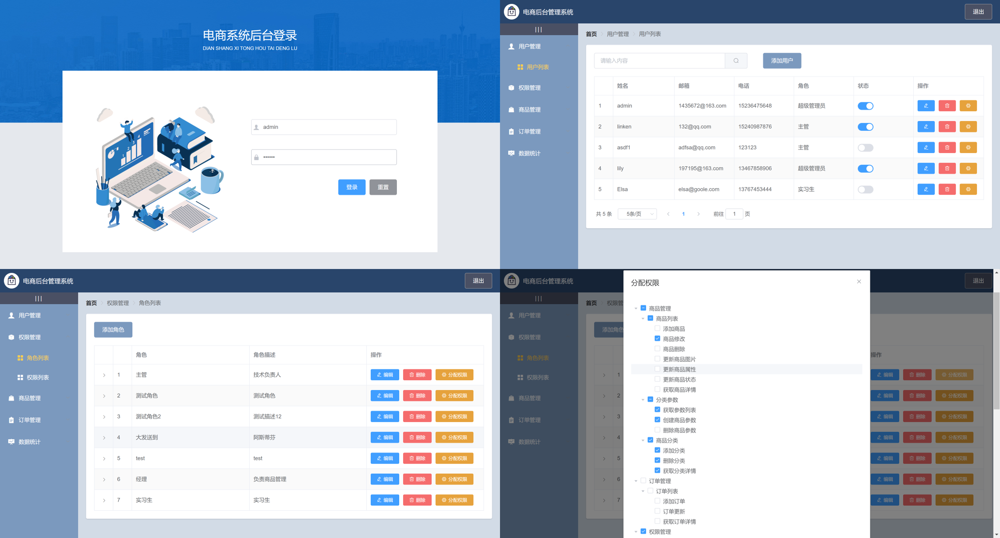
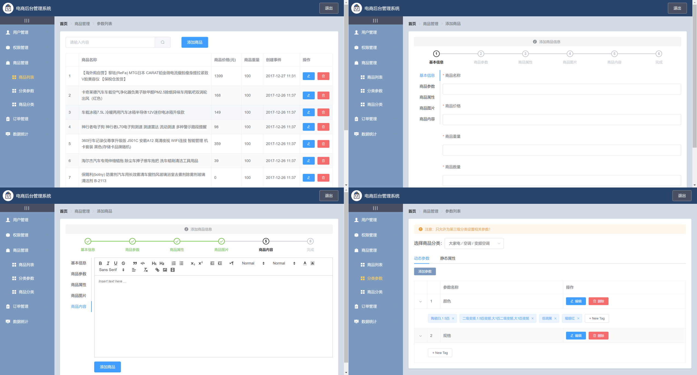
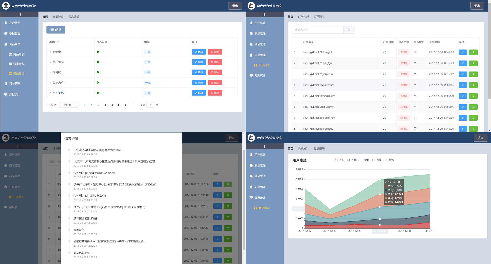

# vue-e-commerce-system
基于Vue全家桶和ElementUI组件库开发的电商后台管理系统

### 效果截屏




### 项目结构
```js

|-- public            // 项目公共部分
|-- src              // 源码目录 
|   |-- assets          // 公共的css样式、图标字体和img
|   |-- network        // 网络请求
|   |-- plugins        // 引入element-ui组件库、引入富文本编辑器vue-quill-editor
|   |-- router          // 路由
|   |-- views        // 全局状态hox目录
|       |--home               // 首页模块、欢迎页面模块
|       |--goods           // 商品管理模块，包括商品列表、分类参数、商品分类
|       |--order           // 订单管理模块，包括订单列表
|       |--power          // 权限管理模块、包括角色列表、权限列表
|       |--report        // 数据统计模块，包括数据报表
|       |--users        // 用户管理，包括用户列表
|       |--Login.vue        // 登录模块
|   |-- App.vue      // 入口文件
|   |-- main.js       // vue挂载文件
|-- .browserslistrc       // 浏览器相关设置
|-- .editorconfig        //代码格式约束文件
|-- .gitignore              // 忽略git
|-- README.md        // 项目说明
|-- babel.config.js	 // babel配置文件
|-- package-lock.json     // npm入口
|-- package.json        // 安装包管理文件
|-- vue.config.js       // 自定义vue配置文件			 
```
### 项目后端API接口
使用node在本地搭建的服务器端口

### 项目安装使用（前端部分）
```
npm install
```

### Compiles and hot-reloads for development
```
npm run serve
```

### Compiles and minifies for production
```
npm run build
```

### Customize configuration
See [Configuration Reference](https://cli.vuejs.org/config/).
